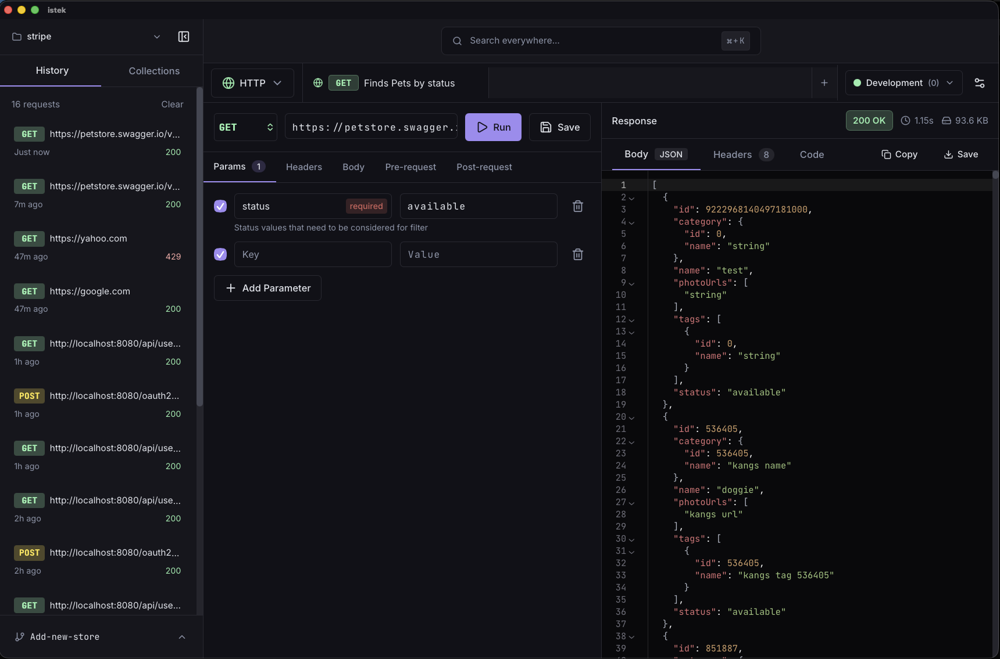
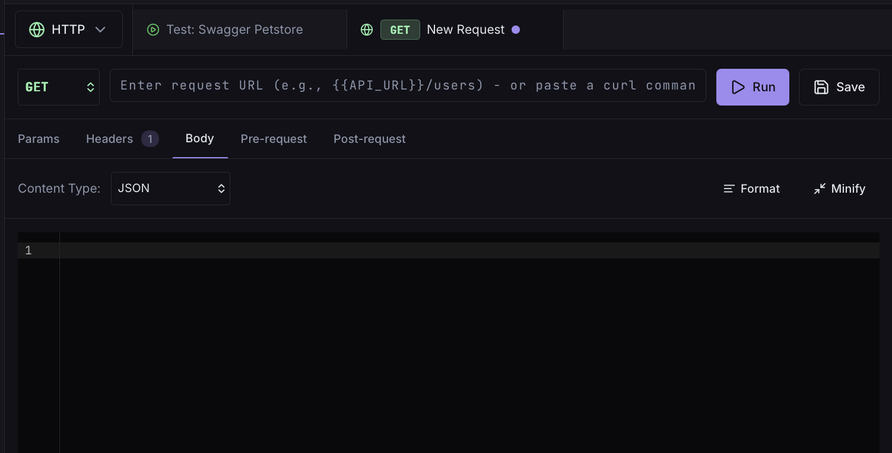
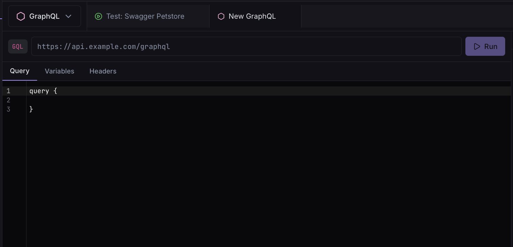
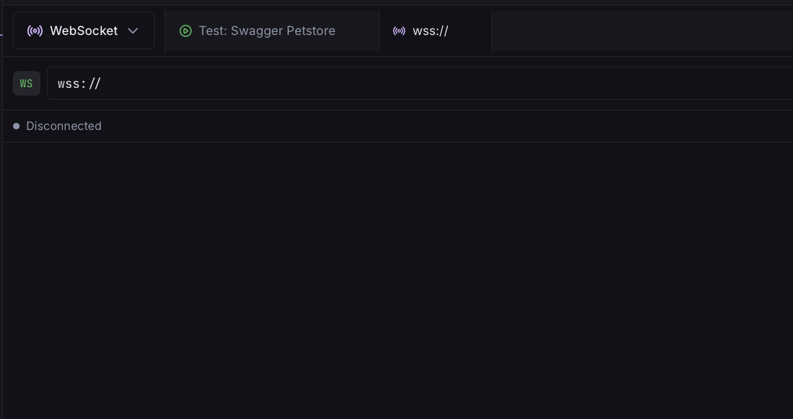
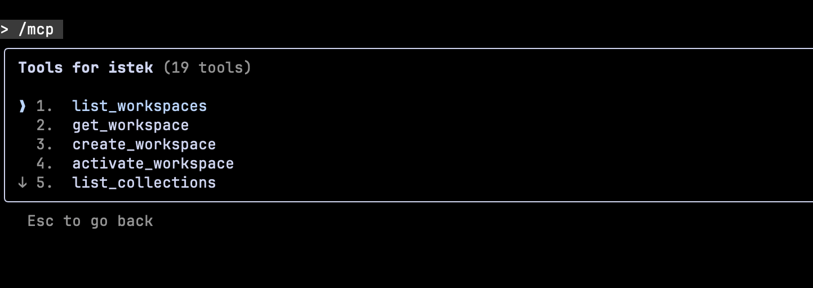
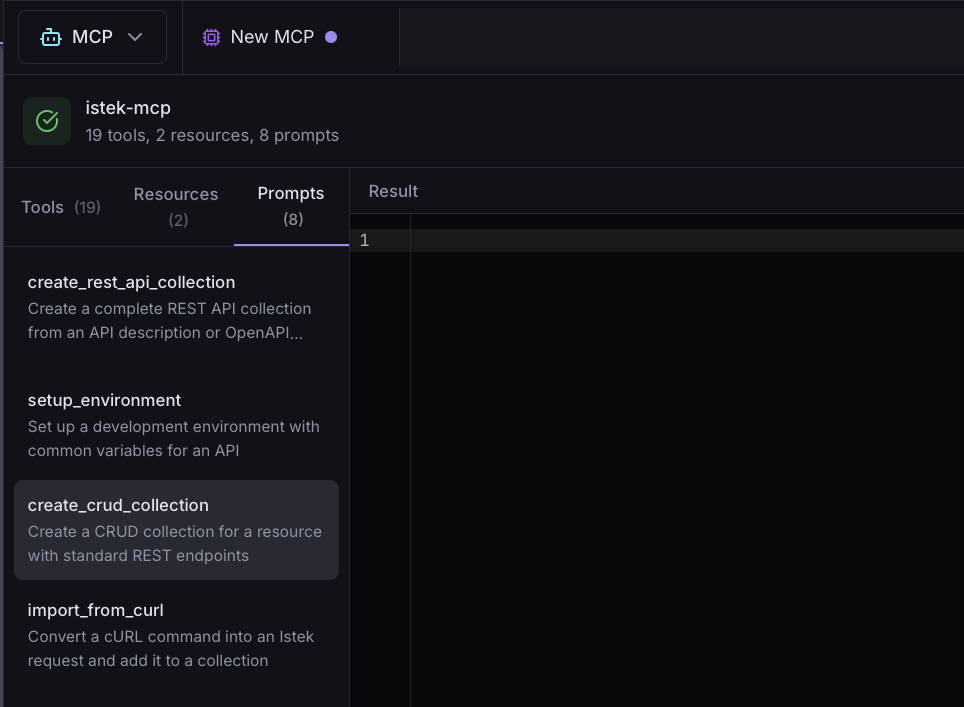
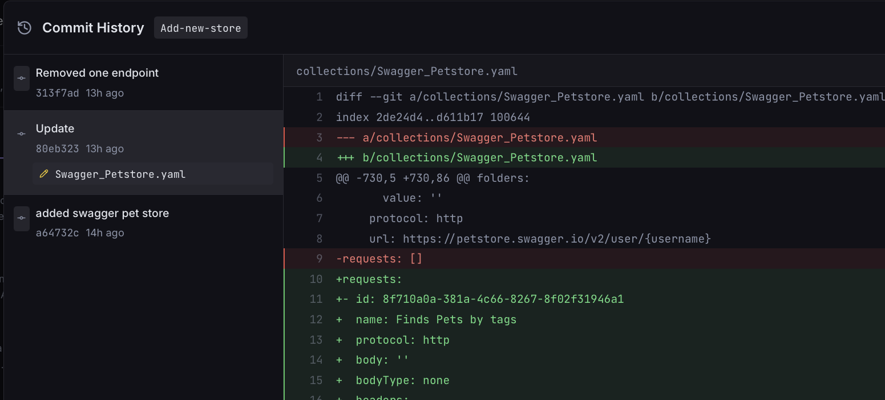
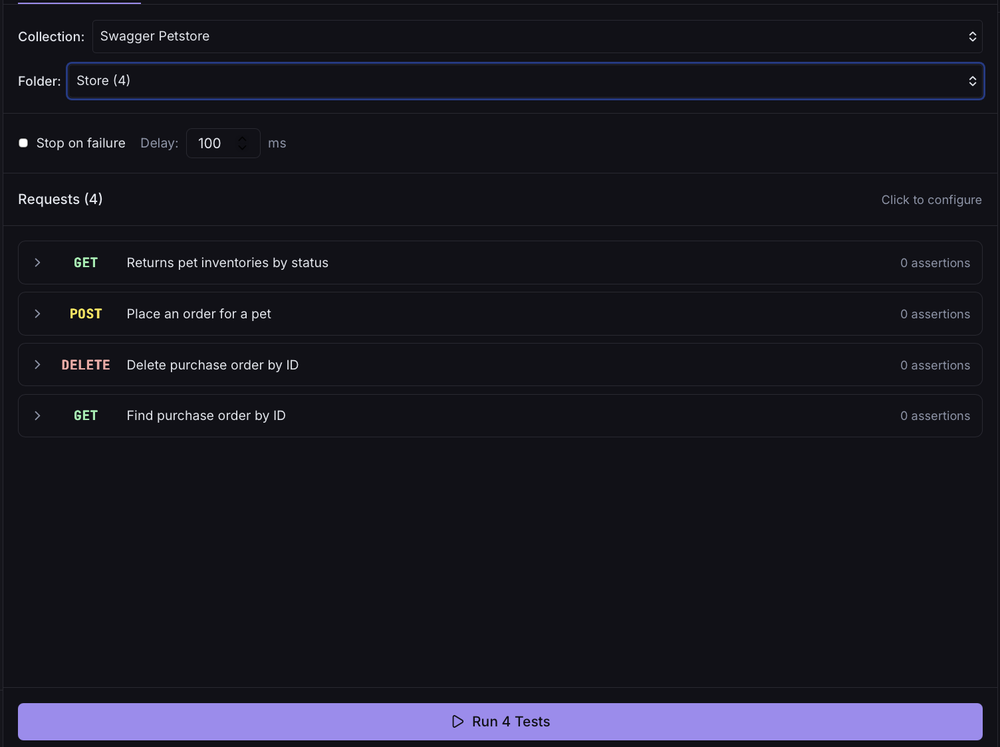
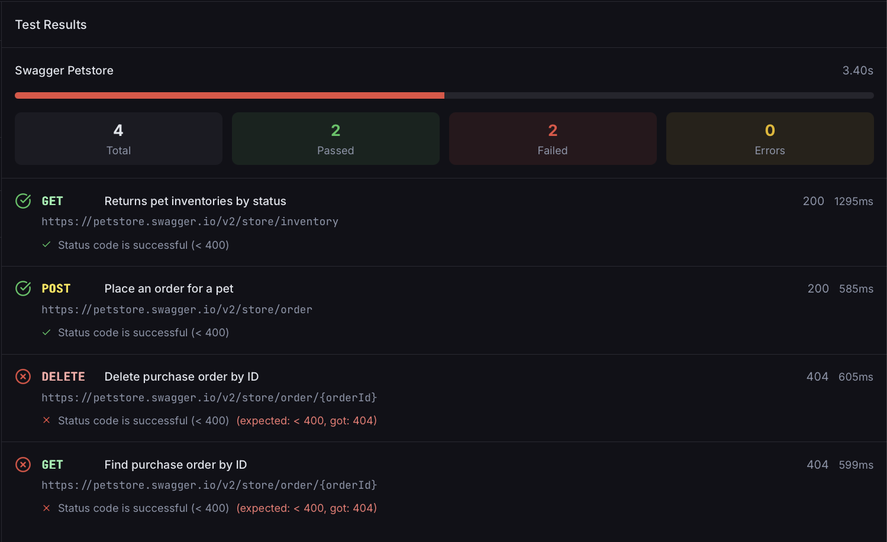

  

<h1 align="center">Istek</h1>

> ⚠️ **Note:** Istek is currently under active development and in the testing phase. The official release is coming soon.

  <strong>AI-Native API Client for the Modern Developer</strong>

  The first API client built from the ground up with AI at its core. 
  REST, GraphQL, WebSocket, gRPC, and MCP – all in one place.

  <a href="https://istek.app/download">Download</a> •
  <a href="https://docs.istek.app">Documentation</a> •
  <a href="https://github.com/istekapp/istek/releases">Releases</a>

 

  

 

## Why Istek?

Traditional API clients were built for a pre-AI world. Istek reimagines API development with intelligence woven into every interaction.

- **AI-Powered** – Generate requests from natural language
- **MCP Support** – Connect AI agents to your APIs  
- **Blazing Fast** – Built with Rust & Tauri
- **Privacy First** – Your data stays on your machine

## Features

### Multi-Protocol Support
Send requests via REST, GraphQL, WebSocket, gRPC, and Server-Sent Events.

  
  
  

### AI Integration
Describe what you want in plain English, get a working request. Expose your collections to AI agents via MCP.

  
  

### Git Sync
Version control your collections with automatic sync. Switch between environments instantly.

  

### Testing & CLI
Run collections with assertions, chain requests with variable extraction, and integrate into CI/CD with the CLI.

  
  

### Secret Management
Connect to HashiCorp Vault, Bitwarden, AWS, GCP, or Azure for secure secret storage.

## Download

Get Istek for macOS, Windows, or Linux at [istek.app/download](https://istek.app/download)

## Contributing

We welcome contributions! Please see our [Contributing Guide](CONTRIBUTING.md) for details.

## License

[MIT License](LICENSE)

---

  Built with ❤️ by the Istek team

  <a href="https://twitter.com/istek_app">Twitter</a> •
  <a href="https://github.com/istekapp/istek/discussions">Discussions</a> •
  <a href="https://istek.app">Website</a>

